# Arkham Horror 2e Helper

A local table companion for **Arkham Horror Second Edition**. It provides a shared
dashboard for the table that can be on a laptop or TV and a phone-friendly controller.

You need node 22, pnpm and docker installed

This is not hosted anywhere and is designed to run on your local private network. Tested on Windows and Linux, not Windows yet. 


It is currently a work in progress!

Todo:
- Still filling in card content so not complete yet (there are a lot of cards)

This is ***not a replacement for the game you must own it and the expansions you wish to play***

Learn more here: https://boardgamegeek.com/boardgame/15987/arkham-horror


All artwork and credits go to the creators of this, this is just a helper. They put in all the real work so we can enjoy. 
https://boardgamegeek.com/boardgame/15987/arkham-horror/credits


The idea is to cut down set up time focussing on: 

- Active rules centralised on screen
- Mythos, Arkham Encounter, Otherworld Encounter are all on screen. 
- Game counters are tracked and visible. 
- Admin backend for custom creation and also import/export of set ups. 
- Add an optional mobile interface to remote control the dashboard.


The physical board remains authoritative. This app tracks state, presents phase
guidance, draws supported digital decks, and lets players correct or advance the
table without replacing the game rules.


Payload CMS admin screens for reference data, and saved game sessions backed by MongoDB.

## Screenshots

### Starting a game

Imagine this on a TV near the game table

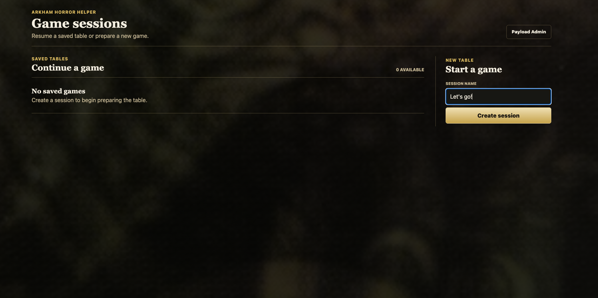

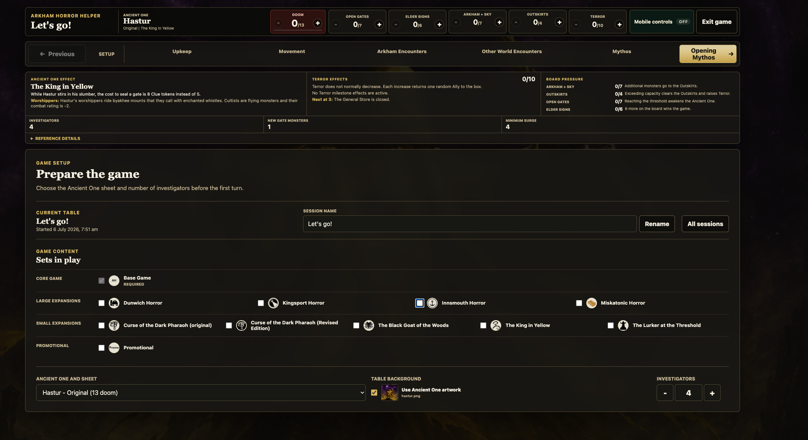 


# Table Dashboard (Opening Mythos)


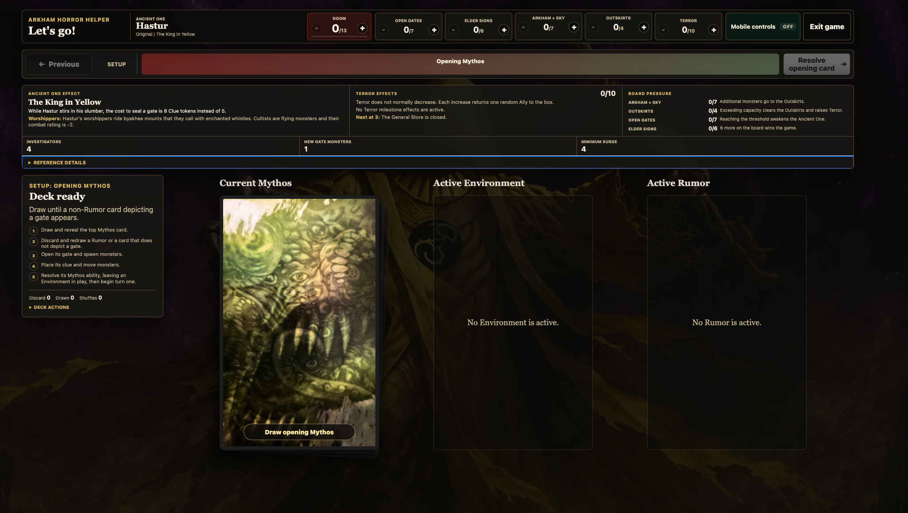
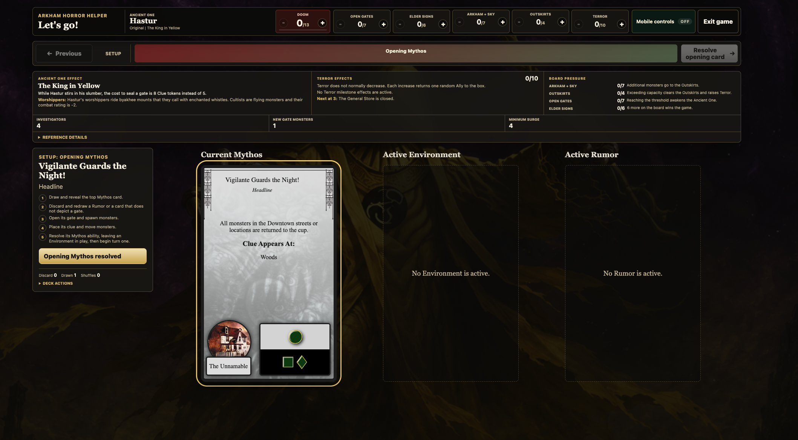


# Table Dashboard (Game Phases)

## Upkeep
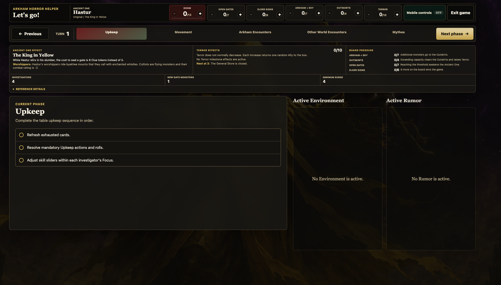

## Movement
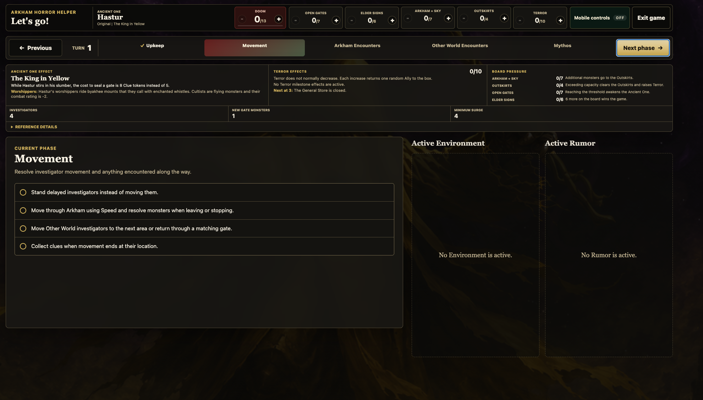

## Arkham Encounters
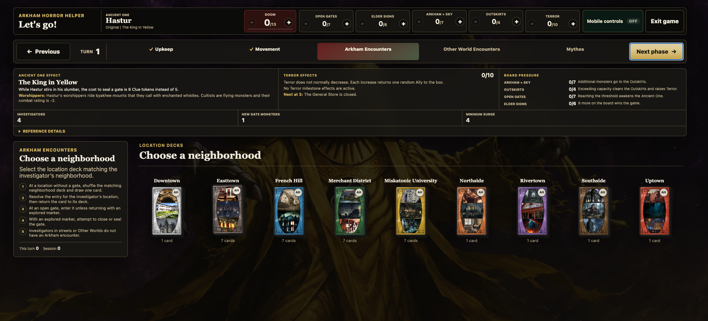
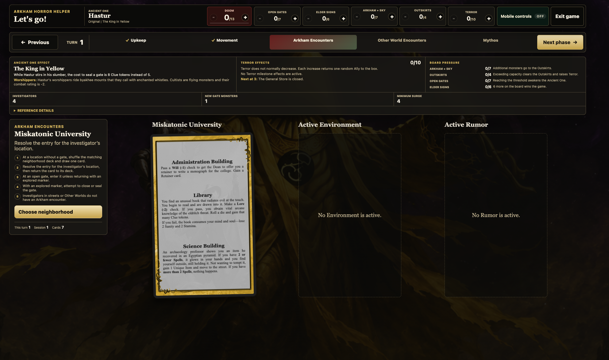

## Other World Encounters
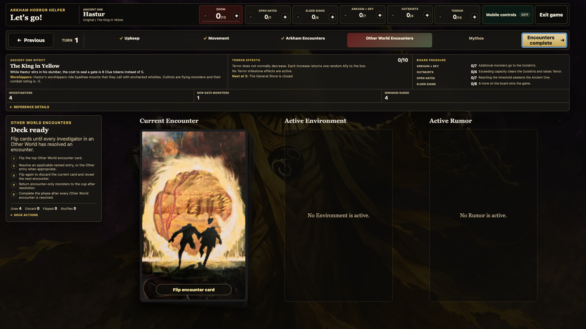
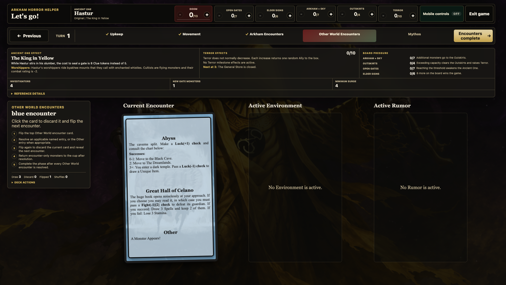

## Mythos with active env

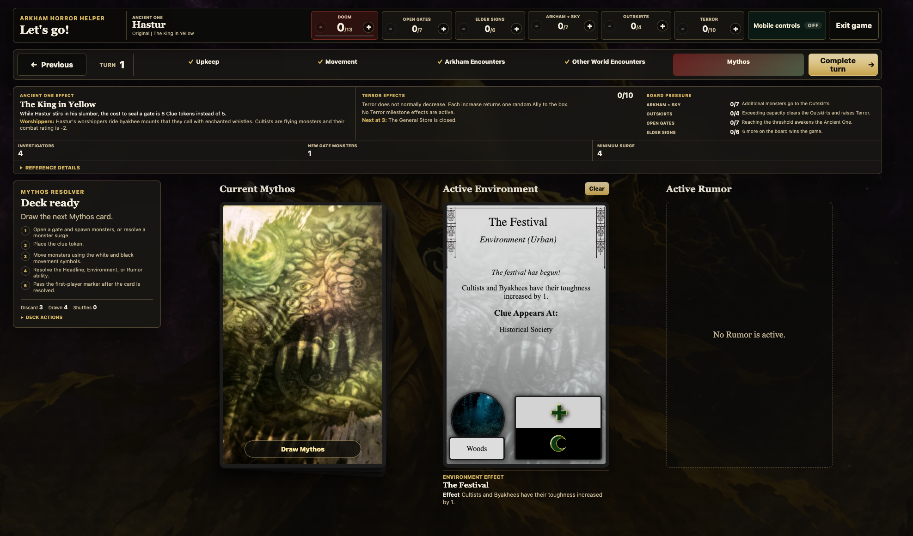


# Mobile Controller Room

Rather than having a keyboard and mouse, which is ok if you want, people can also use their mobile phones to join the game and control it as well. 


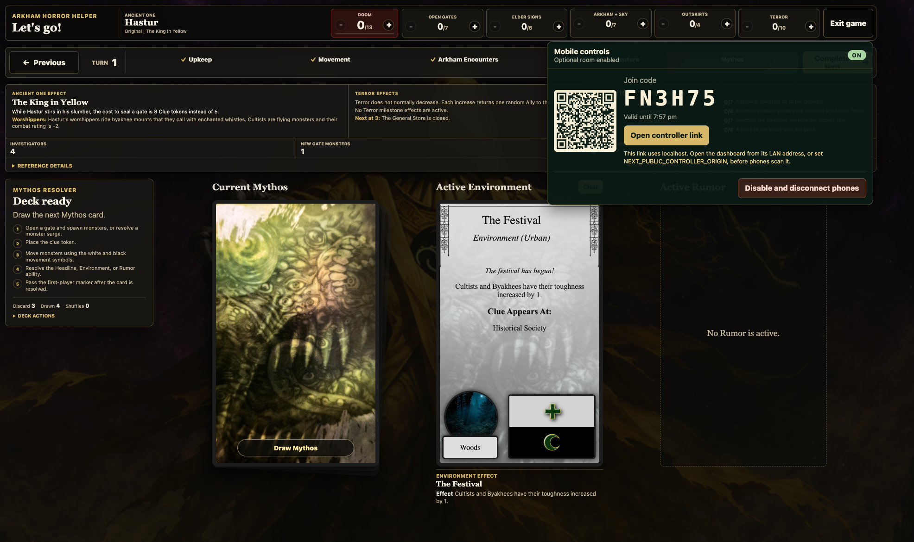

### Phone Controller

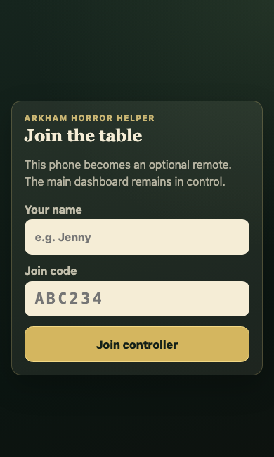
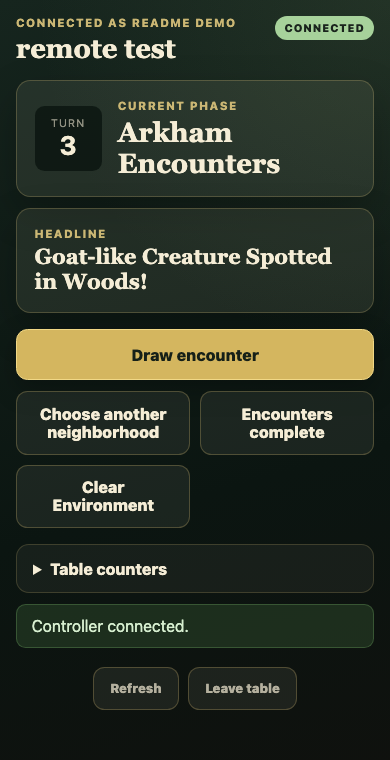


## Requirements

- Node.js `>=22 <26`
- pnpm `>=11 <12`
- MongoDB, either installed locally or run through Docker Compose
- A modern browser for the dashboard and mobile controller

The repo declares `pnpm@11.6.0` in `package.json`. Using Corepack keeps that
version aligned:

```bash
corepack enable
corepack prepare pnpm@11.6.0 --activate
```

## Environment Variables

Copy the example file and then replace the placeholder secrets:

```bash
cp .env.example .env
```

| Variable | Required | Example | Notes |
| --- | --- | --- | --- |
| `DATABASE_URI` | Yes | `mongodb://127.0.0.1:27017/arkham-horror-helper` | MongoDB connection string. Use `mongodb://mongo:27017/arkham-horror-helper` when running the app inside the provided Docker Compose network. |
| `PAYLOAD_SECRET` | Yes | generated with `openssl rand -base64 32` | Signs Payload auth cookies and tokens. Never share a production value. |
| `CONTROLLER_SECRET` | Optional | generated with `openssl rand -base64 32` | Separate signing secret for mobile controller cookies. If omitted, controllers use `PAYLOAD_SECRET`. |
| `NEXT_PUBLIC_CONTROLLER_ORIGIN` | Optional | `http://192.168.1.25:3000` | Origin encoded into QR links for phones. Set this to a LAN or public URL when phones cannot open `localhost`. |

For local play on real phones, start the app on a machine reachable from the
same Wi-Fi network and set `NEXT_PUBLIC_CONTROLLER_ORIGIN` to that machine's LAN
origin before starting Next.js.

## Install And Run Locally

1. Install dependencies:

   ```bash
   pnpm install
   ```

2. Start MongoDB.

   With Docker Compose, running only the database:

   ```bash
   docker compose up -d mongo
   ```

   With the app running on your host machine, keep `DATABASE_URI` pointed at
   `mongodb://127.0.0.1:27017/arkham-horror-helper`.

3. Start the dev server:

   ```bash
   pnpm dev
   ```

4. Open the app:

   - Dashboard: [http://localhost:3000](http://localhost:3000)
   - Sessions: [http://localhost:3000/sessions](http://localhost:3000/sessions)
   - Mobile controller: [http://localhost:3000/controller](http://localhost:3000/controller)
   - Payload admin: [http://localhost:3000/admin](http://localhost:3000/admin)

5. Create the first Payload admin user at `/admin`.

6. Load game data, using either:

   ```bash
   pnpm seed
   ```

   Or the authenticated admin screen:

   ```text
   /admin/game-data
   ```

7. Go to `/sessions`, create or resume a saved table, then use `/` as the live
   table display.


## To really use it

1. Start the production server:

   ```bash
   pnpm run build && pnpm run start
   ```

## Docker

To run both the app and MongoDB in Docker:

1. Set this in `.env`:

   ```bash
   DATABASE_URI=mongodb://mongo:27017/arkham-horror-helper
   ```

2. Start the stack:

   ```bash
   docker compose up
   ```

The `payload` service installs dependencies and runs `pnpm dev` inside the
container. The app is exposed at [http://localhost:3000](http://localhost:3000).

## Mobile Controller Flow

1. Open the live dashboard for an active session.
2. Expand **Mobile controls**.
3. Select **Enable mobile controls**.
4. Phones can join by scanning the QR code, opening the controller link, or
   entering the join code at `/controller`.
5. Each phone enters a display name and receives an HTTP-only controller cookie.
6. The controller shows only actions valid for the current session phase.
7. Disable the room from the dashboard to revoke all connected phones.

Controller rooms expire after 12 hours. If the QR link warns about `localhost`,
set `NEXT_PUBLIC_CONTROLLER_ORIGIN` to the LAN URL that phones should use.

## Useful Scripts

| Command | What it does |
| --- | --- |
| `pnpm dev` | Start the Next.js and Payload dev server. |
| `pnpm build` | Build the production Next.js app. |
| `pnpm start` | Serve the production build. |
| `pnpm seed` | Seed boxed sets, locations, Ancient Ones, Mythos cards, and encounter decks. |
| `pnpm snapshot:game-data` | Regenerate the bundled game-data media fixture. |
| `pnpm generate:types` | Regenerate Payload TypeScript types. |
| `pnpm test:int` | Run Vitest integration tests. |
| `pnpm test:e2e` | Run Playwright end-to-end tests. |
| `pnpm storybook` | Start Storybook for card and UI component work. |

## Architecture

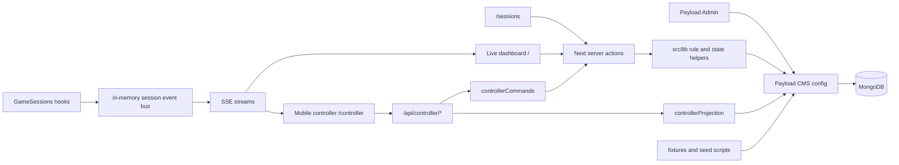

### Main Layers

- `src/app/(frontend)` contains the public app: session hub, live dashboard,
  setup forms, phase controls, deck controls, and mobile controller UI.
- `src/app/api/controller/*` handles phone controller join, session projection,
  command submission, leave, and server-sent event streams.
- `src/app/api/session-events/[sessionID]` streams table changes to live
  dashboard clients.
- `src/collections` defines Payload collections for users, media, boxed sets,
  Ancient Ones, locations, neighborhoods, encounter cards, Mythos cards, other
  worlds, saved sessions, and fixture installations.
- `src/lib` holds the rules-facing state logic: phase flow, session creation,
  Mythos deck state, Arkham and Other World encounter state, expansion tracks,
  investigator limits, controller auth, controller commands, and event streams.
- `src/components` contains card rendering components used by the dashboard,
  previews, and Storybook.
- `src/fixtures`, `src/seed`, and `src/scripts` hold bundled game data and
  repeatable load/generation scripts.

### State Model

Reference data lives in Payload collections. A saved table lives in the
`game-sessions` collection and stores:

- session status, name, investigator count, active Ancient One, and enabled sets
- ordered phase state and phase history
- doom, terror, gates, elder signs, monster, and expansion-board tracks
- copy-aware Mythos and Other World encounter deck state
- Arkham neighborhood selection and encounter draw history
- mobile controller room hashes, expiry, state revision, and command history

The controller never writes directly to MongoDB. It submits a command with the
session revision and an idempotency key. The server checks that the command is
still legal for the current phase, serializes commands per session, applies the
same server action used by the dashboard, records command history, and returns a
fresh projection.

### Live Updates

`GameSessions` increments `stateRevision` in a Payload `beforeChange` hook.
After each change, it publishes a session event. Dashboard and controller
clients subscribe through SSE and refresh their server-rendered or projected
state when a matching session changes.

This event bus is in-memory, which is simple for local play and one Node.js
process. A multi-instance deployment would need a shared pub/sub adapter.

## Rule References

Game rules are requirements for this project. Before changing game state, phase
flow, counters, limits, movement, encounters, gates, monsters, investigators,
Mythos resolution, expansion behavior, or rules-facing UI, read `AGENTS.md` and
the relevant `RULES_*.md` files. Add or update focused regression coverage for
rules-facing behavior.

## Troubleshooting

### The dashboard has no cards or Ancient Ones

Load the bundled game data with `pnpm seed` or visit `/admin/game-data` after
creating an admin user.

### Phones cannot open the QR link

The dashboard was probably opened at `localhost`. Use the machine's LAN URL and
set:

```bash
NEXT_PUBLIC_CONTROLLER_ORIGIN=http://YOUR_LAN_IP:3000
```

Restart `pnpm dev`, reopen the dashboard from the LAN URL, and generate a new
mobile controller room.

### Payload cannot connect to MongoDB

Check that `DATABASE_URI` matches where the app is running:

- app on host, Mongo in Docker: `mongodb://127.0.0.1:27017/arkham-horror-helper`
- app and Mongo in Docker Compose: `mongodb://mongo:27017/arkham-horror-helper`

### Controller command says the table changed

Another browser or phone changed the session first. The controller refreshes and
then shows the actions valid for the new session revision.
